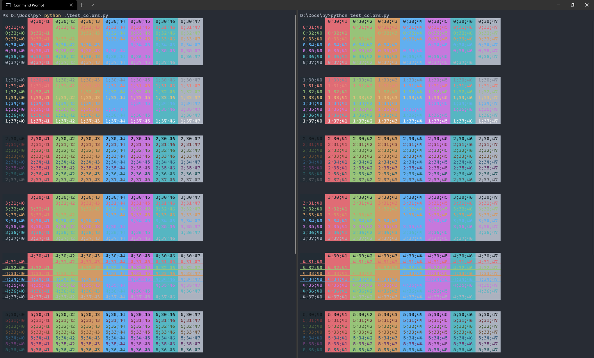

# Windows Terminal One Dark color scheme

One Dark color scheme from [Atom](https://github.com/atom/one-dark-syntax) for [Windows Terminal](https://www.microsoft.com/en-in/p/windows-terminal/9n0dx20hk701?rtc=1&activetab=pivot:overviewtab).

PowerShell at left and cmd at right

# Installation

Open your `settings.json` and `settings.json` from this repository and copy [scheme lines](settings.json#L9-L34) and then in default profile put [color scheme name](settings.json#L4).
